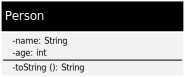

== Class model

In terms of type theory, a class is an implementation of a concrete data structure and collection of related programs.
The Go and Eiffel programming language are very different when it comes to classes.
The following chapter tries to point out the main characteristics of the class model in Go and Eiffel.
The most important is explained briefly in words and then shown by a simple data class, called "person", which holds the name as string and the age as a integer.
In addition to show the usage of the class, a small example is implemented.

.UML representation of a class

.Output of example code
----
Max Mustermann (33 years)
Max Mustermann (34 years)
----

=== Go programming language

Go doesn't require an explicit class definition, instead a "class" is implicitly defined by providing a set of "methods" which operate on a common type.
The type may be a struct or any other user-defined type.
Therefore Go also doesn't require a constructor, setter or accessor for a "data class".

.main.go (data class and usage)
[source,go,indent=0]
----
package main

import "fmt"

type Person struct { <1>
	name string <2>
	age int
}

func (p Person) String() string { <3>
	return fmt.Sprintf("%s (%d years)", p.name, p.age)
}

func main() {
    p := Person{"Max Mustermann", 33} <4>
    fmt.Println(p) <5>
	p.age = 34 <6>
	fmt.Println(p)
}
----
<1> Define the public "data class" / user type **Person**
<2> Define attribute **name** with type **string**
<3> Implement the Stringer interface for the user type **Person** for textual type representation
<4> Create a **Person** object **p** without a explicit constructor
<5> Print textual representation of **Person** object through Stringer interface
<6> Assign new value to **Person** attribute **age** without a explicit setter procedure

=== Eiffel programming language

Eiffel is a class only based programming language in which everything has to be wrapped in a class.
An Eiffel class consists of some headers, optional features and an end delimiter.
Every class in Eiffel inherits implicit from the ANY class which is very similar to the Object class in Java.

==== Headers

The headers define the type of the class and optionally the explicit inheritance with the keyword "inherit" and the constructor routines with the keyword "create".
The class type "class" is a normal class from which an object can be created.
The "deferred class" is an abstract class from which no object can be created and contains at least one signature of an unimplemented routine.

==== Features

The definition of attributes and routines are wrapped in feature clauses.
Every class can have multiple feature clauses.
The designer of a class controls which clients are allowed to call their features.
Feature declarations are organized into groups according to their visibility.
Each group has a header that lists the classes in curly braces that can use the following features.
A client can call a feature only if the client belongs to one of the classes in the list.
If the header does not contain a list, any client can call the features.
If the list is empty or contains the word NONE, the features are for internal use only.

==== Attributes

The definition of attributes requires only a name, followed by a colon and a class/type name.
If attributes are visible to clients, they can only be accessed and not assigned from outside the class by default.
//The value of an attribute can be changed by any feature in the class, but never by a client.
To make it possible to assign values from outside the class, there must be a setter procedure that has one argument of the assigned type and is assigned to the attribute with the keyword "assign".
//The assignment operator is ":=" and the equal sign alone always tests for equality.

==== Routines

The signature of routines is almost similar to those of the attributes, but they have a argument list in parentheses and a body introduced by "do" and delimited by "end" or instead are marked with deferred as unimplemented.
The list of arguments and the return type of routines are optional and can be omitted.
If a return type is defined, there is always a routine local attribute which holds the return value.
The value returned by a function is the value that is in "Result" after the function ends.
"Result" is automatically declared and initialized at the beginning of the function and can be changed as often as required.

.person.e (data class)
[source,eiffel,indent=0]
----
class PERSON <1>
inherit
	ANY
		redefine
			out <2>
		end
create
	make <3>
feature {NONE} <4>
	make (a_name: STRING; a_age: INTEGER)
	    do
		    set_name (a_name)
		    set_age (a_age)
	    end
feature
	name: STRING assign set_name <5>
	age: INTEGER assign set_age
	set_name (a_name: STRING) <6>
        do
            name := a_name
        end
    set_age (a_age: INTEGER)
        do
            age := a_age
        end
	out: STRING <7>
	    do
			Result := name.out + " (" + age.out + " years)"
	    end
invariant
	non_negative_age: age >= 0 <8>
end
----
<1> Define the custom data class **PERSON**
<2> Announce that the **out** function of **ANY** is overridden by **PERSON**
<3> Define the **make** procedure as a constructor of **PERSON**
<4> Constructors should be private in Eiffel because they are only needed for object construction
<5> Define attribute **name** with type **STRING** and assign the setter procedure **set_name**
<6> Define procedure **set_name** with the argument **a_name** with type **STRING**
<7> Redefine function **out** with return value type **STRING** which produces a textual representation of a object
<8> Ensure that attribute **age** becomes never a negative number (class global assertion)

.application.e (usage)
[source,eiffel,indent=0]
----
class
	APPLICATION
create
	make
feature {NONE}
	make
		local
			p: PERSON <1>
		do
			create p.make ("Max Mustermann", 33) <2>
			print (p.out + "%N") <3>
			p.age := 34 <4>
			print (p.out + "%N")
		end
end
----
<1> Declaration of local variable **p** of type **PERSON**
<2> Create a **PERSON** object **p** with constructor **make**
<3> Print textual representation of **PERSON** object **p** with **out** function
<4> Assign new value to **PERSON** attribute **age** through assigned setter **set_age**
