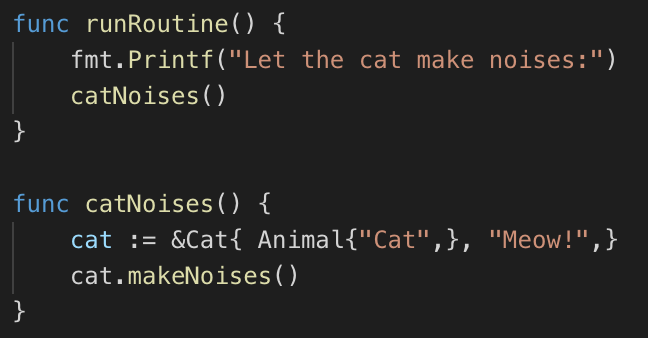
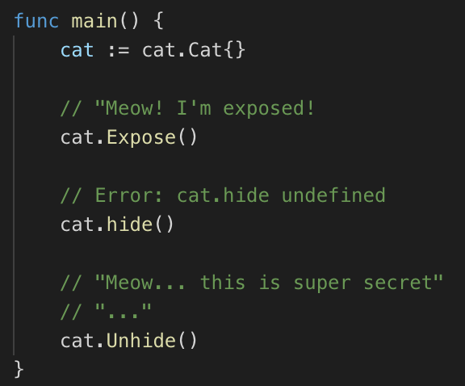
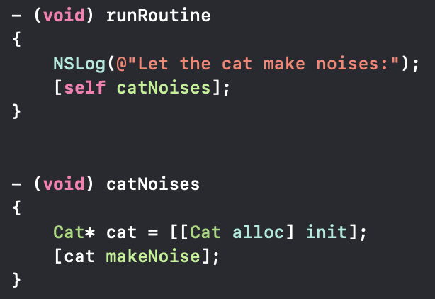

// Header
= Comparison Object Oriented Programming in GO with Objective-C
Slawomir Danzl <slawomir.olszowka@stud.fh-rosenheim.de>
v1.00.00, 2019-01-05
:awestruct-layout: base
:showtitle:
:prev_section: defining-frontmatter
:next_section: creating-pages
:toc:
:toc-placement!:
:icons: font

// Logo

[#img-logo_university]

{empty} +
{empty} +

// Abstract
= Abstract

These days, the world is full of programming languages and they are becoming more and more general and all-purpose, but they still have their specializations and characteristics, and each language has its disadvantages and advantages.

Every computer programmer has few comments on how his programming language of choice is the best. There are common attributes that most programmers want, like an easy to use syntax, better run-time performance, faster compilation and there are more particular functionalities that we need depending on our application. These are the main reasons why there are so many programming languages and a new one being introduced almost daily. 

Languages can generally be divided into many different categories. The following comparision of the two programming languages *Go* and *Objective-C* based the *Concepts of Programming Language* course on the *University of Applied Sciences* in Rosenheim.

*Keywords:* Go, Objective C, Object Oriented Programming

{empty} +
{empty} +

// Table of Content
 
toc::[]

{empty} +
{empty} +

// Acronyms

= List of Abbreviations

[horizontal]
Go:: Programming Language Go
IDE:: Integrated Development Environment
ObjC:: Programming Language Objective-C
OOP:: Object Oriented Programming 

{empty} +
{empty} +

// Document

= Chapter 1  -  Introduction

Object-oriented programming has opened a great perspectives on the concept of software and has been hailed as a part of the solution to the so called “software crisis” <<Coo11>>. It has given the possibility that software components can be constructed and reused with considerably more credibility. 

The following text occupies oneself with the comparision of the  programming languages *Go* and *Objective-C* with regard to the aspect of the object-oriented programming characteristics.

{empty} +
{empty} +

= Chapter 2 - History

One of the very first object-oriented programming languages is Smalltalk. Smalltalk were based on the concepts of class and instance. The majority of the object-oriented languages now in use are based upon these two concepts. Smalltalk also inspired the development of the programic languages Objective-C and Go.

{empty} +

=== 2.1 Development of Go

Go was developed in 2007 by Robert Griesemer, Rob Pike, and Ken Thompson at Google but launched in 2009 as an open source programming language. Go is a procedural programming language. Programs are assembled by using packages, for efficient management of dependencies, and it also supports environment adopting patterns alike to dynamic languages.

The Go language was created because fast languages like C are difficult to work with and not safe. Compiling speed, dependencies and runtime errors are vast. An interpreted language like Ruby is safe but it’s slower and has many dependencies, one of them is the interpreter itself. In contrast Go, it’s been designed for fast compilation in mind from the beginning  <<Gol18>>. 

Google released Go under a BSD-style license and left it to the community to develop Go further. Go became a viable choice for software development.

Even Google isn’t currently using Go in large scale production of applications. While the site that’s hosting the code is running a server built with Go as a proof, the primary purpose of the release was to attract developers and build a Go community around it

{empty} +

=== 2.2 Origin of Objective-C

Objective-C, often called ObjC, is the programming language behind native Apple applications. The language was originally designed in the 1980s as a way to add object-oriented capabilities to ANSI C programming language. Objective-C was the main language used by NeXT for the NeXTSTEP operating system, from which macOS and iOS are derived. Prior to the introduction of Swift it was the main programming language used by Apple for the macOS and iOS operating systems <<Abh03>>. 

Objective-C source code dissociate implementation program files and header files. While Objective-C implementation files usually have .m extensions, header and interfaces files have .h filename extensions.

Objective-C can be seen as Apple’s version of the C# programming language <<Dio16>>.

Behind Objective-C lie many frameworks that provide the tools necessary to build apps in the Apple ecosystem. For example, Cocoa is an advanced object-oriented framework for building applications that run on Apple devices. It is an integrated set of shared object libraries, a runtime system and also a development environment. Cocoa provides most of the infrastructure that graphical user applications typically need and insulates those applications from the internal working of the core operating system.

NOTE: Cocoa can be seen as a layer of objects acting as both mediator and facilitator between programs that are build and the operating system. These object span the spectrum from simple basic types to complex functionality, such as distributed computing.

Cocoa included for example, the UIKit framework which defines the basic UI components on the iPhone, e.g buttons or toolbars. While the Core Data framework provides an API for saving and retrieving data from a device. Objective-C is the glue that merge together these tools and assemble them into a program.

There are many Objective-C-based developer tools, Project Builders or interface design tools, but the integrated development environment (IDE) Xcode merged this development tools into one application <<Xco18>>.

NOTE: Xcode is Apple’s IDE which exists especially for writing applications for various Apple operating systems. With the IDE Xcode developers can write software for macOS, iOS, watchOS and tvOS. It thus serves as a platform for all currently relevant operating systems used in Apple devices.

{empty} +
{empty} +

= Chapter 3 - Object Oriented Programming 

Object-oriented languages are defined by a small set of properties. The extend to which a particular language satisfies these properties defines how much of an object-oriented language it is. 

{empty} +

=== 3.1 Definition

An object is an independent entity which can be treated in isolation of all other objects. It can be passed into and returned from procedures, can be assigned to variables and stored in data structures like lists and arrays. Object are composed of data and operations. Object represent logically distinct entities in a computations.

Objects also exhibit some more general properties:

* encapsulation
* inheritance
* polymorphism
* dynamic method binding

{empty} +

=== 3.2 Encapsulation

The property of encapsulation is the property of information hiding. Encapsulation typically refers to the hiding of data and of the implementation of an object. Data and code, when encapsulated, are hidden from external view. When an external observer views an encapsulated object, only the exterior interface is visible. The internal details are invincible and cannot be accessed. Thus, data which is encapsulated can not directly be manipulated and updated. 

Objects in object-oriented programming lunges contain a local state which is encapsulated.

{empty} +

=== 3.3 Inheritance

Object tend to be defined in terms of other objects, when a new object or kind of object is defined, it is defined in terms of those properties that make it special. Because objects are frequently defined in terms of other objects, a mechanism is present so that the properties of those object upon which a new one depends can be transferred to the new object from the old one. This mechanism is called inheritance.

Inheritance enables programmers to reuse the definitions of previously defined structures. This clearly reduces the amount of work required in producing programs.

{empty} +

=== 3.4 Polymorphism

The word “polymorphism” literally means having many forms. In programming languages, polymorphism is most often taken to be that property of procedures by which they can accept and return values of more than one type. For example, a procedure which takes a single argument is said to be polymorphic if it can accept actual parameters of more than one type.

In object-oriented languages, polymorphes interacts strongly with inheritance, as has just been indicated. Sometimes polymorphism arises because it is necessary to redefine an operation so that it is particularised to a particular object or set of objects. 

{empty} +

=== 3.5 Dynamic Method Binding

Dynamic binding means that the operation that is executed when objects are requested to perform an operation is the operation associated with the object itself and not with one of its ancestors. 

Dynamic binding is another property that has profound implications for object-oriented languages. At a partial level, it means the the operations that are performed are always those associated with the object asked to perform them. At a more theoretical level, dynamic binding interacts with inheritance and with the type structure of a language.

{empty} +
{empty} +

= Chapter 4 - Object Oriented Programming in Go

The Go languge is a integration of old and new ideas. It has a very modern and refreshing approach where it isn't afraid to throw away established notions. Even Google <<Oop18>> as well as the community around Go are not even sure if Go is an object-oriented language <<Med18>>.

Go has no classes, no objects, no exceptions, and no templates. It has garbage collection and built-in concurrency. The most striking omission as far as object-oriented is concerned is that there is no type hierarchy in Go. This is in contrast to most object-oriented languages like Java, Objective-C, C#, and even dynamic languages like Python.

Go has no classes, but it has types. In particular, it has structs, which defines a state. Structs are user-defined types. Struct types (with methods) serve similar purposes to classes in other languages.

Methods are functions that operate on particular types _(see Figure: <>)_.

[#img-go_example_call]
.Method call syntax in Go

{empty} +

Although Go has types and methods and allows an object-oriented style of programming, there is no type hierarchy. There are also ways to embed types in other types to provide something analogous, but not identical, to subclassing. Moreover, methods in Go are more general than in C++ or Java and they are not restricted to structs (classes).

{empty} +

=== 4.1 Encapsulation in Go

Go encapsulates things at the package level. It is possible to hide anything in a private package and just expose specific types, interfaces, and factory functions. Public elements can be exported out of the package and indicated by capitalizing the first letter. Here, public is in quotes because the more accurate terminology is exported vs. unexported elements. Unexported elements are indicated with a lowercase first letter, and can only be accessed within its respective package _(see Figure: <>)_.

[#img-go_encapsulation]
.Example of encapsulation in Go
image::images/go_encapsulation.png[go_encapsulation,440]

{empty} +

In the package encapsulation, Encapsulation (struct), Expose (method), and Unhide (method) are all exported and can be used from other packages.

[#img-go_encapsulation2]
.Example of import an encapsulated package in Go

{empty} +

Here, we imported the package encapsulation as well as its exportable elements into the main package. Note how if we attempted to export the hide method, our compiler would produce an error _"cannot refer to unexported field or method... "_ _(see Figure: <>)_.

{empty} +

=== 4.2 Inheritance in Go

Go is intentionally designed without any inheritance at all. This does not mean that objects (struct values) do not have relationships, instead the Go authors have chosen to use a alternative mechanism to map relationships.

Instead of inheritance Go strictly follows the composition over inheritance principle. Go accomplishes this through both subtyping (is-a) and object composition (has-a) relationships between structs and interfaces. 

{empty} +

=== 4.3 Polymorphism in Go

Modern languages and object-oriented thinking now favor composition over inheritance. Go lacks inheritance and therefore traditional polymorphism.
Polymorphism is the the ability to treat objects of different types uniformly. Go interfaces provide this capability in a very direct and intuitive way. 

Type satisfies Interface without manually implementing it if it defines all the Interface methods.

[#img-go_polymorphism]
.Example of polymorphism in Go
image::images/go_polymorphism.png[go_polymorphism,460]

{empty} +

The calculateWidth function above accepts a slice of Weights interfaces as argument. It calculates the total weight by iterating over the slice and calling calculate method on each of its items. It also displays the weight source by calling source method. Depending on the concrete type of the Weights interface, different calculate() and source methods will be called  _(see Figure: <>)_. 

[#img-go_polymorphism2]
.Output of the polymorphis example
image::images/go_polymorphism2.png[go_polymorphism2,310]

{empty} +

For example polymorphism is achieved in the calculateWeights function  _(see Figure: <>)_.
In the future if a new cat is added, this function will still calculate the total weight correctly without a single line of code change.

{empty} +

=== 4.4 Dynamic Method Binding in Go

The only way to have dynamically dispatched methods is through an interface. Methods on a struct or any other concrete type are always resolved statically.

{empty} +
{empty} +

= Chapter 5 - Object Oriented Programming in Objective-C 

Objective-C provides standard object-oriented constructs like interfaces, classes, class/instance methods, and accessors. But here are a few important differences between other programming languages.

The first thing is that Objective-C uses a completely different syntax for communicating between objects. For example calling a method is like sending a message. Objective-C sends messages from object to object using the square bracket notation. For most practical purposes, sending messages can be considered a method call _(see Figure: <>)_.

[#img-objc_example_message]
.Message syntax in Objective-C

{empty} +

The Second, Objective-C is designed to be a superset of C, meaning it’s possible to compile C code with any Objective-C compiler. This also means that Objective-C and C can be combined in the same project or even in the same file. In addition, most modern compilers add C++ to the mix, so it’s actually possible to mix Objective-C, C++ and C in a single file. This can be very confusing for newcomers to Objective-C, but it also makes the entire C/C++ ecosystem accessible to Mac and iOS apps.

{empty} +

=== 5.1 Encapsulation in ObjC

Objective-C supports the properties of encapsulation and data hiding through the creation of user-defined types, called classes. 

The variable total is private and we cannot access from outside the class. This means that they can be accessed only by other members of the Adder class and not by any other part of your program. This is one way encapsulation is achieved. Methods inside the interface file are accessible and are public in scope.

Naturally, encapsulation in Objective-C is very similar to C. With exception that the compiler will synthesize accessor methods for properties at compile time. But the encapsulation mechanism in Objective-C is weaker than C. This is general problem with any Object Oriented Language. What makes it weaker is necessary relationship between objects. Sometimes the inherited objects need to have access to parent data, this leads to a complex mix of access modifiers.

WARNING: For Objective-C most concerning is dynamic nature of the language. Key-Value Coding, for instance, opens encapsulated data to unexpected access without any compiler protection.

Instance variables in Objective-C can be accessed in a number of options:

* *protected* +
Access is allowed only by methods of the class and any subclasses.

* *private* +
Access is restricted to methods of the class. Access is not available to subclasses.

* *public* +
Direct access available to methods of the class, subclasses and code in other module files and classes.

[#img-objc_encapsulation]
.Encapsulation in Objc
image::images/objc_encapsulation.png[objc_encapsulation,340]

{empty} +

In addition to the illustration _(see Figure: <>)_ the a private property is implemented in the implementation file _(.m)_, and not in the definition file _(.h)_ like the public properties.

{empty} +

=== 5.2 Inheritance in ObjC

Objective-C provides only a multilevel inheritance mechanisms. The usual use of inheritance is to extend existing type for a specific case, specialize more generic type. In example Cat extends Animal to provide methods and propertys from the inheritanced class _(see Figure: <>)_. 

[#img-objc_inheritance]
.Inheritance in Objc
image::images/objc_inheritance.png[objc_inheritance,190]

{empty} +

Inheritance in Objective-C not only allows using existing objects to create new, it is also subtyping mechanism. Subtyping allows using inherited type where the base type can be used, substitute the base type.

NOTE: Objective-C allows only multilevel inheritance, i.e., it can have only one base class but allows multilevel inheritance. All classes in Objective-C is derived from the superclass NSObject.

{empty} +

=== 5.3 Polymorphism in ObjC

In Objective-C, polymorphism is implemented through inheritance and classes naturally encapsulate data. By implementing two separate classes with the same exact function. One object (Cat) can take different forms. The function makeNoise will produce different output, depending on the concrete Class of the object _(see Figure: <>)_.

{empty} +

=== 5.4 Dynamic Method Binding in ObjC

Dynamic binding is possible in Objective-C and it enables polymorphism. For example, consider a collection of objects including Cats and Dogs. Each object has its own implementation of a weight method.

In the following code fragment _(see Figure: <>)_, the actual code that should be executed by the expression [anObject weight] is determined at runtime. 

[#img-objc_dynamic]
.Example of dynamic binding in Objective-C
image::images/objc_dynamic.png[objc_dynamic,490]

{empty} +

The runtime system uses the selector for the method run to identify the appropriate method in whatever class of anObject turns out to be.

{empty} +
{empty} +

= Chapter 6 - OOP Original Conception

The creator of the term “object oriented”, Dr. Alan Kay didn’t based the methodology on previously mentioned mechanics (Encapsulation, Composition, Polymorphism and Inheritance), those evolved further as side effects <<Aal93>>.

Alan Kay’s original conception was based on the following properties:

* messaging
* local retention, protection, and hiding of state-process 
* extreme late-binding of all things

{empty} +

=== 6.1 Messaging

In terms of communication between Objects, how modules, objects communicate should be designed rather than what their internal properties and behaviors should be

[horizontal]
Go :: 
It is possible via Channels.

ObjC ::
In Objective-C methods are dynamically bound to messages, which means that method names are resolved to implementations at runtime. Specifically, the object is examined at runtime to see if it contains a pointer to an implementation for the given selector. As a consequence, Objective-C lets you load and link new classes and categories while it’s running, and perform techniques like swizzling, categories, object proxies, and others. 

{empty} +

=== 6.2 Local Retention and Protecting

In other words, it is the same as encapsulation, which is supported in Objective-C and in Go by defining public/private attributes and methods.

{empty} +

=== 6.3 Late Binding

A higher order function is a function that takes a function as an argument, or returns a function

[horizontal]
Go::
It is possible with higher-order-functions and Interfaces.

ObjC::
Dynamic binding is determining the method to invoke at runtime instead of at compile time. Dynamic binding is also referred to as late binding. In Objective-C, all methods are resolved dynamically at runtime. The exact code executed is determined by both the method name (the selector) and the receiving object

{empty} +
{empty} +

= Chapter 7 - Summary

Objective C enjoys the benefits of Cocoa libraries that ships with Mac OS. Mac OS X and the iPhone are the largest implementations of the language by a big margin. Apple and Objective C stress on object oriented programming and all of the documentation for the language is geared toward object-oriented programming. So in this sense there is a huge difference between Objective C and Go. 

Go is a language promoted by Google, giving it an undeniable advantage in terms of popularity, reputation and technical coverage. Go is young and full of uncertainties. This makes the comparison of these two programming languages rather difficult. Objective-C has all the properties of an object-oriented language, but Go deliberately does not.

The fundamental concepts of object orientation in Go are there. The terminology differences are essential as the mechanisms used are in fact different from most object oriented languages. Go utilizes structs as the union of data and logic. Through composition, has-a relationships can be established between Structs to minimize code repetition while staying clear of the brittle mess that is inheritance. Go uses interfaces to establish is-a relationships between types without unnecessary and counteractive declarations. Go took the best parts of OOP, left out the rest and gave a better way to write polymorphic code.

{empty} +
{empty} +

= Chapter 8 - Future Outlook

There must be a reason behind the growth of the popularity of these two languages. 

Objective-C is a popular choice for many reasons, most of all because its being incorporation of the C programming language which means users get the benefits of C and C++. Objective-C is not a simple language to learn and to read as it is build on C, but it offers plenty of third-party libraries and frameworks. With high flexibility and power, it is a language that supports open style dynamic binding. It also offers pre-processor usage, which means writing complex macros follows an easy process. Objective-C is known for its high speed static code analysis, for instance, the Xcode framework which uses this language reacts quickly to syntactic errors. 

As Objective-C cannot evolve without C, which only offers a two-file system, causing more work for programmers. If you don't want to focus on writing application for iOS or OSX, you shouldn't be concerned with Objective C. Moreover, compared to Swift it is not open source, I don't expect much traction outside the Apple ecosystem. Objective-C is to isolated and there's simply to much language competition.

Far newer than Objective-C, Swift is a multi-paradigm compiled programming language developed by Apple in 2014. Swift was developed for iOS, macOS, watchOS, tvOS and Linux operating systems. It is designed to work with Apple’s Cocoa and Cocoa Touch frameworks, as well as some of Objective-C’s written code. As a newer language than Objective-C, Swift uses the Objective-C runtime library which allows C, C++, Objective-C and Swift code to run together on all platforms except Linux.

Go is a great language, easy to understand and quick to learn, but still powerful. It has skyrocketed lately <<Med16>> and I expect it to become a much more common programming language everywhere in the near future <<Rre18>>. For concurrent programming, Go might be a the better choice.

{empty} +
{empty} +

// Appendix

= References

[horizontal]
Abh03:: [[Abh03]] Amit Singh, A Brief History of Mac OS X, 2003, Mac OS X Internals

Aal93:: [[Aal93]]  Alan Kay, The Early History of Smalltalk, 1993, PDF, called on 2018-12-29 {empty} + 
https://dl.acm.org/citation.cfm?doid=155360.155364

Coo11:: [[Coo11]] Hansen Hsu, Cornell University, 2011 {empty} + 
https://www.sigcis.org/files/Hsu%20--%20Software%20Crisis%20and%20OOP.pdf

Dio16:: [[Dio]] Marilyn Sanders Dive into Objective C, 2016, BookRix

Eff13:: [[Eff13]] Matt Galloway, Effective Objective-C 2.0, 2013, Addison-Wesley Professional

Gol18:: [[Gol18]] Website, golang.org, called on 2018-12-22, {empty} +
https://golang.org/doc/faq#history

Han18:: [[Han18]] Tarik Guney, Hands-On Go Programming, 2018, Packt Publishing

Med16:: [[Med16]] Website, medium.com, called on 2018-12-22, {empty} +
https://medium.com/@richardeng/the-little-language-that-could-61eaa62b5e0a

Med18:: [[Med18]] Website, medium.com, called on 2019-01-01, {empty} +
https://medium.com/gophersland/gopher-vs-object-oriented-golang-4fa62b88c701

Obj11:: [[Obj11]] Aaron Hillegass, Objective-C Programming, 2011, Addison Wesley

Oop07:: [[Oop07]] Iain D. Craig, Object-Oriented Programming, 2007, Springer-Verlag

Oop18:: [[Oop18]] Website, golang.org, called on 2018-12-22, {empty} +
https://golang.org/doc/faq#Is_Go_an_object-oriented_language

Rre18:: [[Rre18]] Website, redmonk.com, called on 2018-12-16, {empty} + 
https://redmonk.com/sogrady/2017/06/08/language-rankings-6-17/

Sta18:: [[Sta18]] Website, stackoverflow.com, called on 2018-12-18, {empty} + 
https://insights.stackoverflow.com/trends?tags=go%2Cerlang%2Celixir

Xco18:: [[Xco18]] Website, apple.com, called on 2018-12-27, {empty} + 
https://developer.apple.com/xcode/

{empty} +
{empty} +

= List of Figures

[horizontal]

<> :: Method call syntax in Go

<> :: Hiding with encapsulation in Go

<> :: Import an encapsulated package in Go

<> :: Implementation of polymorphism in Go

<> :: Output of the polymorphism example

<> :: Messages (Method call) syntax in Objective-C

<> :: Hiding with encapsulation in Objective-C

<> :: Inheritance in Objective-C

<> :: Example of dynamic binding in Objective-C

<> :: Stack Overflow activity chart (Go vs Erlang/Elixir)
