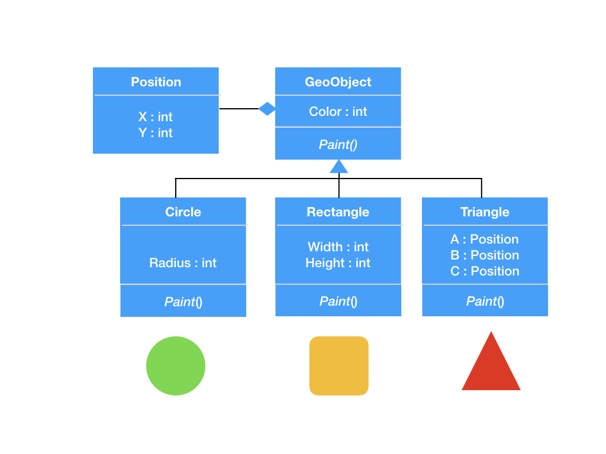

# Exercise 3 - OOP in Go

If you do not finish during the lecture period, please finish it as homework.

## Exercise 3.1 - Interfaces, Polymorphism and Embedding

The image shows a typical UML design with inheritance, aggregation and polymorph methods.



Implement this design as close as possible to the design in Go:
- The Paint() method should print the names and values of the fields to the console
- Allocate an array of polymorph objects and call Paint() in a loop 

## Exercise 3.2 - Mail Component and Service Locator
Implement the following interface:
```go
type Sender interface {

	// Send an email to a given address with a  message.
	SendMail(address Address, message string)
}
```
Implement the interface and write a client. The implementation should be provided by
a simple self made service locator registry:

```go
// Create an implementation for the mail.Sender interface
var sender = Registry.Get("mail.Sender").(mail.Sender)

mailaddrs := mail.Address{Address:"test@test.com"}
sender.SendMail(mailaddrs, message)
```
Interface, client and implementation should be in seperate packages. 

