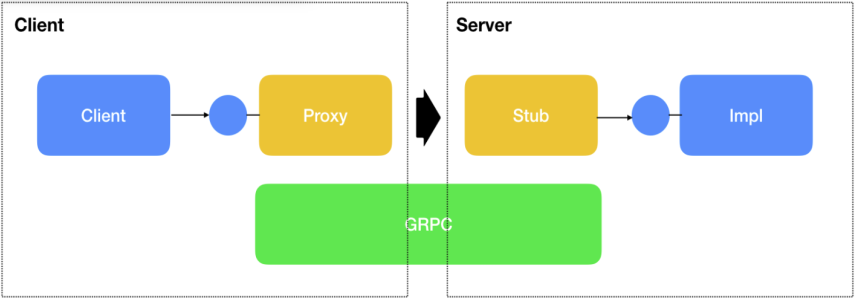
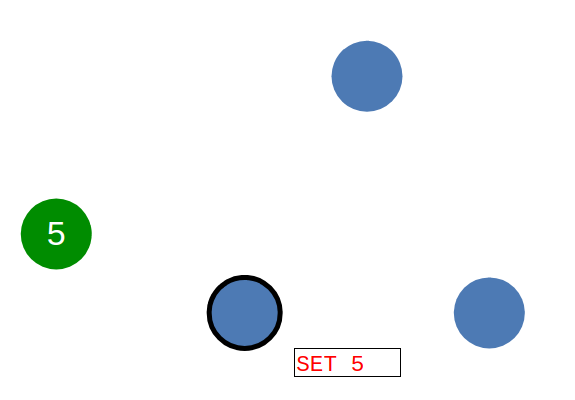

= Distributed Programming, Go compared to Python
Paul Vieweger
:toc:

Distributed Programming is an important technique to keep Software scalable and fast. If ten thousands of people use your Software, a single Processor won't handle the load. Therefore the load has to be divided on multiple servers. In this work I am going to compare Go to Python in Distributed Programming.

== Client server data transmission with gRPC

To transmit data over the network you have to encapsulate them somehow. You have to tell the other side how the data should be interpreted. The gRPC(gRPC remote Procedure Call) is a framework developed by Google to communicate between client and server. With gRPC you can call methods on other computers, the data is transmitted on a binary level over IP-Packets. The IP-Packets are transmitted over HTTP, so that the firewall of the network doesn't require special rules. In the following picture shows how a connection between client and server looks like.

The Stub is an abstraction level, to abstract the technical code from business code. The business code uses an interface of the Stub. Through that, the business Logic stays clean from the implementation of the transmitting of data. Also it is now possible to replace the stub with an local implementation, this makes testing a lot easier. You don't need a server to run a test from your application. The Stub is something similar to the controller in the model view controller pattern, if you make an UI.

To call methods on the server, you use the generated methods from the gRPC service code. The gRPC service code is independent from programming languages. The protoc compiler compiles the gRPC service code into the specific programming language. Technical you can use on one side Python and on the other side Go. But this is not recommended because you should keep the count of programming languages to a minimum. Also some complex data types, like Date may differ in different languages, so it is not easy to transmit data from one language to another. 

You can also use XML and JSON instead of gRPC for communication between client and server. The drawback of XML and JSON is, that it takes more computation to parse your data from the RAM view of data to XML or JSON. For example in XML and JSON you translate a number from binary into ASCII and back, with gRPC you send just the binary data (gRPC takes care of Little Endian Big Endian).

Because of the gRPC service code there is no differences in the techniques of communication between Go and Python. In the following you see a simple example of gRPC service code to call a method on the server.

[source, gRPC]
----
// The Mail service definition.
service Mail {
  // Sends a mail
  rpc SendMail (MailRequest) returns (MailReply) {}
}

// The request message containing the address and the body of the mail.
message MailRequest {
  string address = 1;
  string content = 1;
}

// The response message containing the answer of the server
message MailReply {
  bool hasSucceeded = 1;
}
----

=== Proxy and Stub Implementation in Go

In the following you will see how a implementation of the client in Go looks like. The variable err is set when some transmission failure happens, like network is down. The Proxy wraps those errors to something else, like a log or exception.

[source, golang]
----
// Proxy on Client side.
type Proxy struct {
	connection *grpc.ClientConn
}

// NewProxy creates a Proxy and starts the server connection
func NewProxy() *Proxy {
	p := new(Proxy)
	conn, err := grpc.Dial("localhost:50051", grpc.WithInsecure())
	if err != nil {
		panic(fmt.Sprintf("did not connect: %v", err))
	}
	p.connection = conn
	return p
}

// SendMail implementation
func (p *Proxy) SendMail(address string, content string) {
  c := Mail.NewMailClient(p.connection)
	ctx, cancel := context.WithTimeout(context.Background(), time.Second)
	defer cancel()
  r, err = c.SendMail(ctx, &Mail.MailRequest{Address: address, Content: content})
  if err != nil {
    log.Fatalf("could not send Mail: %v", err)
  }
  if r.HasSucceeded {
    log.Printf("Mail was send!)
  }
}
----

In the following you will see how the implementation of the server in Go looks like.

[source, golang]
----
// Server is used to implement Mail.RegisterMailServer
type Server struct{}
// Stub on server
func (s *server) SendMail(ctx context.Context, in *pb.MailRequest) (*pb.MailReply, error) {
	log.Printf("Send Mail to: %v", in.Address)
	return &pb.MailReply{HasSucceeded: true}, nil
}
----

In the following you will see how the server in Go is started.

[source, golang]
----
func StartMailServer() {
	lis, err := net.Listen("tcp", ":50051")
	if err != nil {
		log.Fatalf("failed to listen: %v", err)
	}
	s := grpc.NewServer()
	Mail.RegisterMailServer(s, &stub.Server{})
	// Register reflection service on gRPC server.
	reflection.Register(s)
	if err := s.Serve(lis); err != nil {
		log.Fatalf("failed to serve: %v", err)
	}
}
----

=== Proxy and Stub Implementation in Python

In the following code snipped you will see how a implementation on the client in Python looks like.

[source,python]
----
# Proxy on client
def SendMail(address, content):
  channel = grpc.insecure_channel('localhost:50051')
  stub = sendMail_pb2_grpc.MailStub(channel)
  response = stub.SendMail(sendMail_pb2.MailRequest(address=adress,content=content))
  if response.hasSucceeded:
    print("Mail was send!")
----

In the following you will see how the implementation on the server in Python looks like.

[source,python]
----
# Stub on Server
class Mail(sendMail_pb2_grpc.MailServicer):

  def SendMail(self, request, context):
    print("Send Mail to:" + request.address)
    return sendMail_pb2.MailReply(hasSucceeded=True)
----

In the following you will see how the server in Python is started.

[source,python]
----
def StartMailServer():
    server = grpc.server(futures.ThreadPoolExecutor(max_workers=10))
    sendMail_pb2_grpc.add_MailServicer_to_server(Mail(), server)
    SERVICE_NAMES = (
        sendMail_pb2.DESCRIPTOR.services_by_name['Mail'].full_name,
        reflection.SERVICE_NAME,
    )
    reflection.enable_server_reflection(SERVICE_NAMES, server)
    server.add_insecure_port('[::]:50051')
    server.start()
    try:
        while True:
            time.sleep(_ONE_DAY_IN_SECONDS)
    except KeyboardInterrupt:
        server.stop(0)
----

If you compare Python with Go there is no major difference between both sides in transmission of data with gRPC. The gRPC service code stays the same between both, because it can be compiled in both languages. The methods which are generated are equal, only fitted to the specific language. In Python you will need more code to enable reflection.

== Raft

The Raft Algorithms is used to ensure that all server have a consensus with each other how the current data set looks like. It doesn't happen that one server has the opinion to answer the client "good morning" and another "good evening". The system never answers with wrong or inconsistent data. It doesn't answer at all if it is not sure that a consensus exists.

There exists three stats for a node: follower, candidate and leader.
First we talk about how new data is transmitted in a twostep process. In the following figure you will see a simple cluster. The blue nodes represent the server. The green node is the client who want to write new data. In the first step the leader writes the new data he receives from the client to all other nodes. If the leader could write the data on a majority of Nodes he commits the new data. The commit is a second Message to all Nodes that the written data is the new data set they should reply to a client. The cluster has now again a consensus how the data looks like. Now, if you like to read the data you always get the new data. The process is called Log Replication.

The second part of the Raft Algorithms is how the leader selection works. First all Nodes start as follower. If there is no current leader, after a random timeout a node will become a candidate. A candidate sends an message to all other nodes and says he wants to become the next leader. If he receives an okay from the majority, he will become the next leader. If a candidate doesn't receive the majority he will fall back to the follower state. For example when the candidate is in a minor cluster split or when multiple candidates exists. The leader pings all other member, if they are alive he get an answer. Each node also have a number which indicates which leader selection round he is in. If a leader detects another leader with a higher number he will become a follower. In the following image you will see the various states a node can be in.

image::Raft_states.png[Raft states, title="Raft states <<Shu>>"]

Raft was developed 2014 in a phd Thesis at Stanford University. There already exists implementations in Python and Go for Raft. So there is no difference in using Raft between Python and Go. The most important programs in Distributed Programming are using the Raft Algorithms, like Kubernetes and Docker Swarm.

=== Raft Business API in Go

To use the server cluster with the Raft Algorithms you need to specify an API which represents the use cases. In the following you will see how an interface in Go would look like.
[source, golang]
// Simple interface, read/writes money to a bank account
type BankAccount interface {
  SetCurrentAmount(id int, money int)
  GetCurrentAmount(id int) int
}

=== Raft Business API in Python

To use the server cluster with the Raft Algorithms you need to specify an API which represents the use cases. Because Python doesn't own interfaces, I used an abstract class, which is something similar to an interface. In the following you will see the abstract class implementation in Python. 

[source, python]
// Simple abstract Class, read/writes money to a bank account
class BankAccount(abc.ABC):
    @abc.abstractmethod
    def SetCurrentAmount(self, id, money):
        pass
    @abc.abstractmethod
    def GetCurrentAmount(self, id):
        pass

== Docker and Kubernetes

The most important programs you will need in Distributed Programming are Docker and Kubernetes. Those Programs are the foundation of Distributed Programming. 

Docker is included in Kubernetes, and is something similar to a Operating System, just lightweight. It doesn't have the overhead of a traditional virtual machine. To use Docker you need an image of the programs you would like to execute. An important note is that you don't need to include all files from the Linux system in the image. For example you don't need an UI, for you server program. You just need the files, like libraries, which are used by your application. You also don't need to include the Linux Kernel which is already provided by the host system. A container is the runtime of a Docker image. In the following Image you will see how a container looks like.

image::why_containers.svg[Why containers, title="Why containers <<Kub>>"]

Kubernetes manages multiple containers and helps you to automatic release and update software also it helps with logging and monitoring. It uses the Raft Algorithms, so you can share data between containers from Docker. Kubernetes is some necessary framework to make Distributed Programming easy. Instead of Kubernetes you can also use Docker Swarm. Although Kubernetes was programmed in Go you can use Go and Python for the Kubernetes API. I still would use Go to use the API of Kubernetes, because it was native programmed in Go.

== Conclusion

There is no difference in Go and Python between the transmission of data between multiple Computers, because gRPC Service Code, which is used to generate the code for communication, is independent of programming languages. Although you need a compiler who can compile the gRPC Service Code, but there exists one for Python and Go. The Raft Algorithms which is used to synchronize data and makes sure that each server answers correctly is also language independent. Kubernetes is programmed in Go and therefore better uses in Go than in Python.

Another point are the specific language features. For example Concurrent Programming is needed because a server is usually called by multiple clients at the same time, who want to access the same Database. Go uses channels and Go routines for concurrent programming. Channels can't do more than traditional low-level locks, but they are easier to program. Also Go uses a build in Deadlock detection, Python doesn't own that. With the -race flag on compilation in Go you can detect if two threads wanted to access an unprotected variable at runtime. If the part of the code is not run, then of course the race condition is not detected.

Also Go uses static type checking instead of dynamic type checking like Python. Static type checking allows to detect errors at compile time, whereas Python detects them at runtime, which is more error prone.

Therefore Go is better than Python in Distributed programming because Kubernetes is native programmed in Go and Go can handle the concurrent Programming better than Python. Another important Point is that you can easy build Tests and Binaries for Deployment in Go, which raises productivity.

[bibliography]
== References

- [[[Wei]]] Distributed Programming with Go https://github.com/jweigend/concepts-of-programming-languages/blob/master/docs/08-Distributed-Programming.pdf access on 28.12.2018.

- GRPC with Go https://grpc.io/docs/quickstart/go.html access on 30.12.2018.

- GRPC with Python https://grpc.io/docs/tutorials/basic/python.html access on 31.12.2018.

-  [[[Joh]]] Raft Understandable Distributed Consensus http://thesecretlivesofdata.com/raft/ access on 3.0.2019

- [[[Shu]]] Understanding the Raft consensus algorithm: an academic article summary https://medium.freecodecamp.org/in-search-of-an-understandable-consensus-algorithm-a-summary-4bc294c97e0d access on 4.1.2019

- [[[Kub]]] Why containers https://kubernetes.io/docs/concepts/overview/what-is-kubernetes/ access on 5.1.2019.

- Why did Google use the Go language for Kubernetes?https://www.quora.com/Why-did-Google-use-the-Go-language-for-Kubernetes access on 5.1.2019.

- Kubernetes with Go https://github.com/kubernetes/client-go access on 2.1.2019.

- Kubernetes with Python https://github.com/kubernetes-client/python access on 2.1.2019.