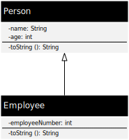

== Inheritance

Inheritance in object-oriented programming is the principle of class hierarchy.
It is the ability of an object or class to inherit the attributes, behavior, and functionality of another object or class.
Parent classes can have child classes which can have the same properties of the parent classes and can define new attributes, behaviors and functionality of their own.
Additionally it's possible that child classes override functionality or behavior of their parent classes.
The relationship between a parent and a child class is often described as a "is a" relationship.
This chapter uses the data class "Employee" which is inherited from the data class "Person" with an additional employee number attached.

.UML representation of class inheritance

.Output of example code
----
12346: Thomas Bauer (25 years)
12346: Thomas Huber (25 years)
----

=== Go programming language

.person.go (data class)
[source,go,indent=0]
----
package main

import "fmt"

type Person struct {
	name string
	age  int
}

func (p Person) String() string {
	return fmt.Sprintf("%s (%d years)", p.name, p.age)
}
----

.employee.go (inherited data class)
[source,go,indent=0]
----
package main

import "fmt"

type Employee struct {
	Person <1>
	employeeNumber int
}

func (e Employee) String() string {
	return fmt.Sprintf("%d: %s", e.employeeNumber, e.Person) <2>
}
----
<1> Inherit all properties from **Person** for "class" **Employee**
<2> Generate textual representation of **Employee** with the use of the **String()** method of **Person**

.main.go (specialized data class)
[source,go,indent=0]
----
package main

import "fmt"

func main() {
	e := Employee{Person{"Thomas Bauer", 25}, 12346} <1>
	fmt.Println(e)
	e.name = "Thomas Huber" <2>
	fmt.Println(e)
}
----
<1> Create a **Employee** "object" with a embedded **Person** "object"
<2> Assign another name to the **Employee** "object"

=== Eiffel programming language

.person.e (data class)
[source,eiffel,indent=0]
----
class PERSON
inherit
	ANY
		redefine
			out
		end
create
	make
feature {NONE}
	make (a_name: STRING; a_age: INTEGER)
	    do
		    set_name (a_name)
		    set_age (a_age)
	    end
feature
	name: STRING assign set_name
	age: INTEGER assign set_age
	set_name (a_name: STRING)
        do
            name := a_name
        end
    set_age (a_age: INTEGER)
        do
            age := a_age
        end
	out: STRING
	    do
			Result := name.out + " (" + age.out + " years)"
	    end
invariant
	non_negative_age: age >= 0
end
----

.employee.e (inherited data class)
[source,eiffel,indent=0]
----
class
	EMPLOYEE
inherit
	PERSON <1>
		rename <2>
			make as person_make,
			out as person_out
		end
create
	make
feature {NONE}
	make (a_name: STRING; a_age, a_employee_number: INTEGER)
		do
			person_make (a_name, a_age) <3>
			set_employee_number (a_employee_number)
		end
feature
	employee_number: INTEGER assign set_employee_number
	set_employee_number (a_employee_number: INTEGER)
		do
			employee_number := a_employee_number
		end
	out: STRING
		do
			Result := employee_number.out + ": " + person_out <4>
		end
end
----
<1> Inherit everything from class **PERSON** for new class **EMPLOYEE**
<2> Rename inherited class routines **make** and **out** as we define them new in class **EMPLOYEE** and want to use the inherited routines internally in the new class
<3> Use renamed constructor **make** of class **PERSON** in constructor **make** of class **EMPLOYEE**
<4> Generate textual representation of **EMPLOYEE** with the use of the renamed **out** function of **PERSON**

.application.e (usage)
[source,eiffel,indent=0]
----
class
	APPLICATION
create
	make
feature {NONE}
	make
		local
			e: EMPLOYEE
		do
			create e.make ("Thomas Bauer", 25, 12346) <1>
			print (e.out + "%N")
			e.name := "Thomas Huber" <2>
			print (e.out + "%N")
		end
end
----
<1> Create a object **e** of class **EMPLOYEE** which is inherited from class **PERSON**
<2> Assign another name to the **EMPLOYEE** object
